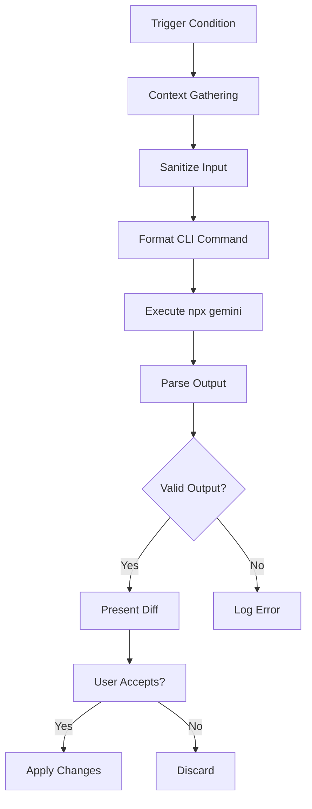

# Gemini CLI Integration Skill

## 🟢 Overview

This skill enables the IDE to leverage the **Google Gemini CLI** (`npx gemini`) for complex development tasks that exceed local linting or basic code completion capabilities. The Gemini CLI provides AI-assisted code explanation, test generation, refactoring suggestions, and documentation generation.

**Key Capabilities:**
- Code explanation and logic flow analysis
- Unit test generation (pytest, Jest, Mocha)
- Refactoring suggestions based on best practices
- Docstring and documentation generation
- Legacy code migration assistance
- Complex debugging and stack trace analysis

---

## 🛠 Available Commands

The following CLI patterns are available for delegation:

| Task Type | CLI Pattern | Description |
|-----------|-------------|-------------|
| **Code Explanation** | `npx gemini prompt "Explain this code: $(cat file.py)"` | Summarizes logic and flow |
| **Unit Test Gen** | `npx gemini prompt "Generate pytest tests for: $(cat file.py)"` | Generates test suites |
| **Refactoring** | `npx gemini prompt "Refactor for DRY: $(cat file.py)"` | Suggests improvements |
| **Docstring Gen** | `npx gemini prompt "Add docstrings: $(cat file.py)"` | Adds formatted docstrings |
| **Debug Analysis** | `npx gemini prompt "Analyze this error: [error]"` | Analyzes stack traces |
| **Migration** | `npx gemini prompt "Migrate to TypeScript: $(cat file.js)"` | Converts code between languages |

---

## 🧠 Delegation Logic

### System Prompt Template

When delegating to Gemini, use this system prompt structure for high-quality output:

```
You are an expert software engineer integrated into the Antigravity IDE. 
Your output must be valid code or Markdown. 
STRICT OUTPUT RULES:
1. Do NOT include conversational filler (e.g., "Here is the code", "I have refactored").
2. Do NOT attempt to use tools or simulate agentic behavior.
3. Provide ONLY the requested code or analysis.
4. Focus on efficiency, type safety, and adherence to project standards.

Context: [Project type, language, framework, quality scale]
Task: [Specific task description]
Input: [Code or file content]
```

### Trigger Conditions

Delegate to Gemini CLI when encountering:

1. **Boilerplate Creation**: Need repetitive structures (DTOs, CRUD endpoints, test scaffolds)
2. **Legacy Migration**: Converting between language versions (Python 2→3, JS→TS)
3. **Complex Debugging**: Analyzing multi-layer stack traces against codebase
4. **Documentation Gaps**: Generating comprehensive docstrings for undocumented code
5. **Refactoring Opportunities**: Improving code quality (DRY, SOLID principles)
6. **Test Coverage**: Generating tests for uncovered code paths

---

## 📂 Workflow Integration

### Automated Execution Flow

The IDE follows this sequence when a Gemini task is triggered:



**Steps:**

1. **Context Gathering**: Collect current file and imported local modules
2. **Sanitization**: Remove secrets, truncate large files (see Safety section)
3. **CLI Execution**: Run `npx gemini` with formatted prompt
4. **Output Parsing**: Extract code blocks and validate syntax
5. **Diff Review**: Present side-by-side comparison for user approval
6. **Application**: Apply accepted changes to source files

---

## 🐍 Python Wrapper Script

A Python wrapper script (`scripts/gemini_cli.py`) provides:

- **Automatic secret detection and redaction**
- **Token limit handling (summarization for large files)**
- **Task-specific prompt templates**
- **Diff generation and validation**
- **Integration with existing workflows**

### Usage

```bash
# Direct invocation
python .agent/skills/gemini-cli/scripts/gemini_cli.py \
  --task explain \
  --file path/to/file.py

# Via workflow integration
# (See /gemini workflow)
```

**Supported Tasks:**
- `explain`: Code explanation
- `test`: Test generation (specify framework with `--framework`)
- `refactor`: Refactoring suggestions (specify issue with `--issue`)
- `doc`: Documentation generation
- `debug`: Error analysis (provide error message with `--error`)

---

## ⚠️ Safety & Constraints

### Data Privacy

**🔒 Never send to Gemini CLI:**
- `.env` files or environment variables
- Hardcoded credentials (API keys, passwords, tokens)
- PII (Personally Identifiable Information)
- Secret keys or certificates

**Sanitization Rules:**
- Pattern matching for common secret formats (API keys, tokens)
- Allowlist for safe file types (`.py`, `.ts`, `.js`, `.md`)
- User confirmation for files containing sensitive patterns

### Token Limits

**Handling Large Files:**
- Files > 10,000 lines: Auto-summarize with `--summarize` flag
- Files > 50,000 tokens: Split into logical chunks
- Warning before sending files > 5,000 lines

**Chunking Strategy:**
```python
# For large files, split by:
1. Top-level functions/classes
2. Logical modules or sections
3. Import statements + focused area
```

### Verification Requirements

**All Gemini-generated code MUST:**
- ✅ Pass local linting (ruff, eslint)
- ✅ Pass type checking (mypy, TypeScript)
- ✅ Have tests written/updated
- ✅ Follow project code standards
- ✅ Be reviewed before commit

**Never auto-commit Gemini output** - always require human review.

---

## 🔄 Integration with Existing Workflows

### /codereview Workflow

Gemini CLI can assist with code review by:
- Explaining complex logic sections
- Suggesting type hints and documentation
- Identifying potential bugs or anti-patterns

### /pytest Workflow

Enhance test generation:
- Generate test scaffolds for new features
- Suggest edge cases and boundary conditions
- Create fixtures for complex setup

### /quality_scale Workflow

Support quality scale compliance:
- Add missing docstrings (Platinum requirement)
- Suggest async refactorings
- Generate comprehensive type hints

---

## 📋 Task-Specific Templates

### Code Explanation Template

```bash
npx gemini prompt "
Context: Home Assistant custom component (Python 3.13, async)
Task: Explain the logic and flow of this code
Focus: Data flow, async operations, error handling

Code:
$(cat file.py)
"
```

### Test Generation Template

```bash
npx gemini prompt "
Context: Home Assistant integration (pytest, pytest-homeassistant-custom-component)
Task: Generate comprehensive pytest tests
Requirements:
- Use async fixtures
- Mock external API calls
- Cover happy path and error cases
- Follow existing test patterns

Code to test:
$(cat file.py)

Existing test pattern:
$(cat tests/test_example.py | head -50)
"
```

### Refactoring Template

```bash
npx gemini prompt "
Context: TypeScript + LIT 3.0 (Lovelace card)
Task: Refactor for DRY principle
Output Format: Return the fully refactored code block ONLY. Do not use tool calls.
Requirements:
- Extract reusable components
- Maintain type safety
- Preserve functionality
- Follow LIT best practices

Code:
$(cat component.ts)
"
```

---

## 🎯 Best Practices

### When to Use Gemini CLI

**✅ Good Use Cases:**
- Generating boilerplate for new features
- Explaining unfamiliar code sections
- Creating test scaffolds
- Adding comprehensive documentation
- Migrating between versions/languages

**❌ Avoid for:**
- Simple refactorings (use IDE tools)
- Known patterns (use snippets)
- Security-sensitive operations
- Production-critical logic without review

### Prompt Engineering Tips

1. **Be Specific**: Include exact requirements and constraints
2. **Provide Context**: Project type, language version, frameworks
3. **Show Examples**: Include existing code patterns to match
4. **Set Boundaries**: Specify what NOT to change
5. **Request Format**: Ask for specific output format (code only, diff, explanation)

---

## 🏁 Success Criteria

Before accepting Gemini CLI output:

- [ ] Output passes local linting
- [ ] Type checking succeeds
- [ ] Tests pass (existing + new)
- [ ] No secrets or sensitive data exposed
- [ ] Follows project code standards
- [ ] Logic is correct and maintainable
- [ ] Documentation is accurate

---

## 📚 Resources

- **Wrapper Script**: `.agent/skills/gemini-cli/scripts/gemini_cli.py`
- **Workflow**: `.agent/workflows/gemini.md`
- **Home Assistant Standards**: `GEMINI.md`
- **Lovelace Standards**: `.agent/skills/lovelace-lit-dev/SKILL.md`

---

**Remember**: Gemini CLI is a powerful assistant, but **human review is mandatory**. Always verify output, never blind-commit AI-generated code, and ensure all safety constraints are followed.
